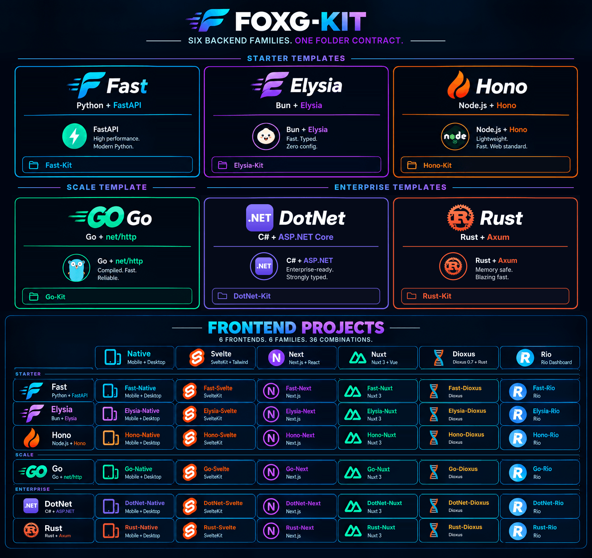

[](./FoxG-Kit.png)

# Rust-Dioxus

**Rust + Axum + SQLx + Tokio + Dioxus + PostgreSQL + Redis. Rust end to end.**

The full-Rust kit of the FoxG family. The backend is the same Axum API as [Rust-Svelte](../rust-svelte/README.md) and speaks the [FoxG wire contract](../../../CONTRACT.md). The frontend is one [Dioxus](https://github.com/dioxuslabs/dioxus) 0.7 crate that builds for **web, Windows, macOS, Linux, Android, and iOS**, with the same dashboard on every platform.

**Docs:** [AGENTS.md](AGENTS.md) · [ROADMAP.md](ROADMAP.md) · [docs/](docs/) · [frontend](frontend/README.md) · [plans](__plans__/PROGRESS.md) · [`__ctrl__`](__ctrl__/README.md)

```bat
__ctrl__\rust-dioxus-ctrl.bat setup-local
__ctrl__\rust-dioxus-ctrl.bat dev run all
__ctrl__\rust-dioxus-ctrl.bat native run desktop
```

Linux and macOS use `__ctrl__/rust-dioxus-ctrl.sh`. `setup-local` installs Rust (rustup) and the Dioxus CLI `dx` if they are missing, adds the `wasm32` target, and runs `cargo fetch` for the backend and the client. There is no Node.js: `dx` runs Tailwind itself. Prerequisites: Python 3.10+ for `__ctrl__`, Docker. On Windows, Rust links with the MSVC Build Tools (C++ workload).

| Service | URL |
|---------|-----|
| Dashboard (web client) | http://dashboard.localhost |
| Sample notes | http://dashboard.localhost/sample/notes |
| API (Swagger) | http://api.localhost/docs |
| API (Scalar) | http://api.localhost/sdoc |
| Adminer | http://adminer.localhost |
| Traefik | http://localhost:8080 |
| Direct dx dev server | http://localhost:5000 |
| Direct API | http://localhost:8000/docs |
| Superuser | `admin@example.com` / `Admin@1234` |

## Clients

One crate in `frontend/`. `dx` picks the renderer from the platform.

| Platform | Run (hot reload) | Package | Builds on |
|----------|------------------|---------|-----------|
| Web (wasm) | `dev run all` | `prod start` (nginx image) | any |
| Windows | `native run desktop` | `native build windows` → `.msi`, `.exe` (NSIS) | Windows |
| macOS | `native run desktop` | `native build macos` → `.app`, `.dmg` | macOS |
| Linux | `native run desktop` | `native build linux` → `.deb`, `.AppImage`, `.rpm` | Linux |
| Android | `native run android` | `native build android` → `.apk`, `.aab` | any (SDK + NDK) |
| iOS | `native run ios` | `native build ios` → `.app`, `.ipa` | macOS (Xcode) |

`native doctor` checks the toolchain for every platform. `native setup <platform>` installs the rustup targets (and the WebKitGTK packages on Linux). Bundles land in `frontend/dist/<platform>`.

The web client calls `/api/v1` on its own origin; in dev `dx` proxies it to the API (see `frontend/Dioxus.toml`). Native clients call `http://127.0.0.1:8000/api/v1`; `native run android` runs `adb reverse tcp:8000 tcp:8000` so the emulator or device reaches the host API. For release builds pass the API: `native build android --api https://api.example.com/api/v1`.

## Layout

```text
backend/                    Rust API and worker (same as Rust-Svelte)
  migrations/               plain SQL, applied when the API starts
  src/modules/apps/sample   notes, the canonical example
  src/modules/base/         auth and users
  src/modules/system/       health and private dev routes
  src/core/                 config, db, cache, jobs, security, errors, docs
frontend/                   Dioxus client: web, desktop, mobile
  src/modules/apps/sample   notes API client
  src/modules/base/         auth, users, shell, stores, ui primitives
  src/routes/               pages: /, /login, /sample/notes, /admin
  Dioxus.toml tailwind.css  dx config and Tailwind tokens
tests/                      backend/ (Axum) and frontend/ (client logic)
traefik/ docs/ __plans__/
__ctrl__/                   Python CLI: dev, native, test, app, prod, remote
compose.yml compose.dev.yml
```

Layers: Route (Axum handler) → Service → Repository (trait, SQLx) → PostgreSQL. See [docs/architecture.md](docs/architecture.md).

## Runtime profiles

| Profile | Command | Includes |
|---------|---------|----------|
| Full | `dev run all` | Postgres, Redis, worker, Traefik, Adminer, API, dx (web) |
| Slim | `dev run all --slim` | Postgres, Traefik, Adminer, API, dx (web) |

Production always runs the full stack. See [docs/runtime-profiles.md](docs/runtime-profiles.md).

## Adding a feature

```bat
__ctrl__\rust-dioxus-ctrl.bat app create bookmarks
```

It writes the backend router stub, `frontend/src/modules/apps/bookmarks/`, the page `frontend/src/routes/dashboard/bookmarks.rs`, and registers the route. Then:

1. Merge the router in `backend/src/modules/apps/mod.rs` and copy the depth of `sample` (router, service, repository, schemas).
2. Add `backend/migrations/NNNN_<name>.sql` when tables change.
3. Add a sidebar link in `frontend/src/modules/base/app_sidebar.rs`.
4. Add tests in `tests/backend/` (and `tests/frontend/` for client logic).

The page appears on every platform at once.

## Changing backend

The client only speaks HTTP to the contract, so `frontend/` runs unchanged against any FoxG backend (Fast, Elysia, Hono, Go, DotNet). That is the plan for Fast-Dioxus, Elysia-Dioxus, and Hono-Dioxus. To move a project:

1. Take the target template.
2. Copy `frontend/` (or the product's `frontend/src/modules/apps/<name>/` and its routes).
3. Rebuild `<name>` under the target's backend path. Keep the routes and JSON from [CONTRACT.md](../../../CONTRACT.md).
4. Point it at the same database. Fast's Alembic tables and this kit's `backend/migrations` are the same schema.

Index: [foxg-kit](../../../README.md).

## Tests

```bat
__ctrl__\rust-dioxus-ctrl.bat test all
```

`test backend` runs the Axum integration tests in `tests/backend/*.rs`. `test frontend` runs `tests/frontend/*.rs` (`cargo test --no-default-features`, no renderer) and checks that the web client compiles for wasm32. `test contract` runs the wire contract against a live API. See [docs/testing.md](docs/testing.md).

## Production

```bat
__ctrl__\rust-dioxus-ctrl.bat setup
__ctrl__\rust-dioxus-ctrl.bat clone
__ctrl__\rust-dioxus-ctrl.bat env
__ctrl__\rust-dioxus-ctrl.bat start
```

`compose.yml` builds the API and the web client (`dx bundle --platform web --release`, served by nginx). Desktop and mobile packages ship separately from `native build`. See [docs/deployment.md](docs/deployment.md).

## Environment

Copy `.env.example` to `.env`. Variable names match Fast (`SECRET_KEY`, `POSTGRES_*`, `REDIS_*`, `FIRST_SUPERUSER*`). The API and worker read `.env` from the kit root. `PUBLIC_API_BASE_URL` is where the client calls the API. It is read when the client compiles. Native builds also read it at run time, so a packaged desktop app can point at another server.

Other families: [Rust-Svelte](../rust-svelte/README.md), [Rust-Native](../rust-native/README.md), [Fast-Svelte](../../../fast-kit/fast-template/fast-svelte/README.md), [DotNet-Svelte](../../../dotnet-kit/dotnet-template/dotnet-svelte/README.md).
